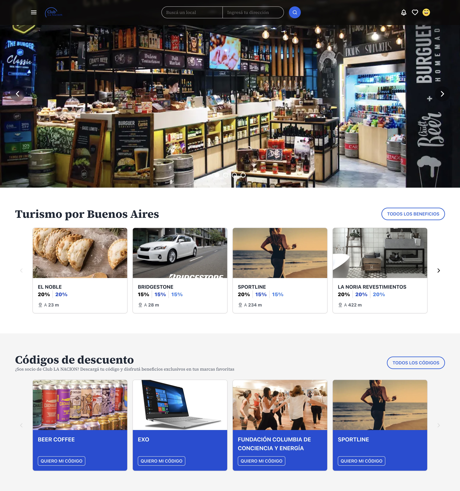

# Club La Nación Clone - Fullstack Exercise

Este proyecto es una implementación del ejercicio solicitado para la posición Fullstack en **La Nación**, siguiendo las especificaciones brindadas. La aplicación está construida en **Next.js** y contiene una API simulada a partir de un archivo JSON que proporciona los datos necesarios para alimentar los componentes del frontend.

<p align="center">
   
   <a href="https://lanacion-clone.santiagodenicolas.com/">
      🌎 Live Demo
   </a>
</p>

## 📋 Requerimientos del ejercicio

Los principales objetivos de este ejercicio fueron:

- **Maquetación**: Se realizó a partir del diseño provisto, incluyendo un layout estático que incluye un slider no funcional y un input de búsqueda.
- **Componentización**: Se crearon componentes reutilizables sin la utilización de librerías de terceros.
- **Generación de API**: Se generó una API a partir de un archivo JSON que contiene cuentas, sucursales, beneficios, y tags.

### Funcionalidades específicas:

1. **Primer Carrusel (Turismo en Buenos Aires)**:

   - Se filtraron las cuentas con el tag "Turismo" en Buenos Aires.
   - Se ordenaron las cuentas por la sucursal más cercana.
   - Se devolvieron las primeras 4 cuentas ordenadas.
   - Cada tarjeta muestra:
     - Nombre de la cuenta.
     - Imagen de la cuenta.
     - Enlace a la cuenta (ej: https://club.lanacion.com.ar/{CRMID}).
     - Beneficio más alto.
     - Distancia a la sucursal más cercana.

2. **Segundo Carrusel (Cuentas con Voucher Activo)**:
   - Se filtraron las cuentas con el flag `haveVoucher` activo.
   - Se ordenaron alfabéticamente de forma descendente.
   - Se devolvieron las primeras 4 cuentas.
   - Cada tarjeta muestra:
     - Nombre de la cuenta.
     - Imagen de la cuenta.
     - Enlace y botón de Promocode.

## 🚀 Tecnologías utilizadas

- **Next.js** para Server-Side Rendering (SSR).
- **React** para la construcción de componentes.
- **Fetch API** con `async/await` para las consultas a la API simulada.
- **Vercel** como plataforma de despliegue.

## 📁 Estructura del Proyecto

```
/src
│
├── /app
│   ├── components/   # Componentes reutilizables como tarjetas, carruseles, headers
│   ├── api/          # API interna del proyecto que sirve datos del JSON
│   ├── page.tsx      # Página principal
│   ├── layout.tsx    # Estructura global de la aplicación
│   └── globals.css   # Estilos globales
│
└── /public
    ├── /images       # Imágenes públicas estáticas
```

## 🛠 Instalación y configuración

1. Clona este repositorio:

   ```bash
   git clone https://github.com/tu-usuario/club-lanacion-clone.git
   ```

2. Instala las dependencias:

   ```bash
   pnpm install
   ```

3. Inicia el servidor de desarrollo:

   ```bash
   pnpm dev
   ```

4. Abre el navegador en:
   ```
   http://localhost:3000
   ```

## 🌟 Funcionalidades implementadas

- **Carruseles con paginación**: Se desarrollaron dos carruseles siguiendo los criterios de filtrado y ordenamiento solicitados.
- **Renderizado de cuentas**: Las tarjetas de cuentas se generan dinámicamente a partir de la API, mostrando información relevante como beneficios, distancias y enlaces.
- **Estático y funcional**: Se incluyeron componentes como slider e input de búsqueda de manera estática, como se especificó.
